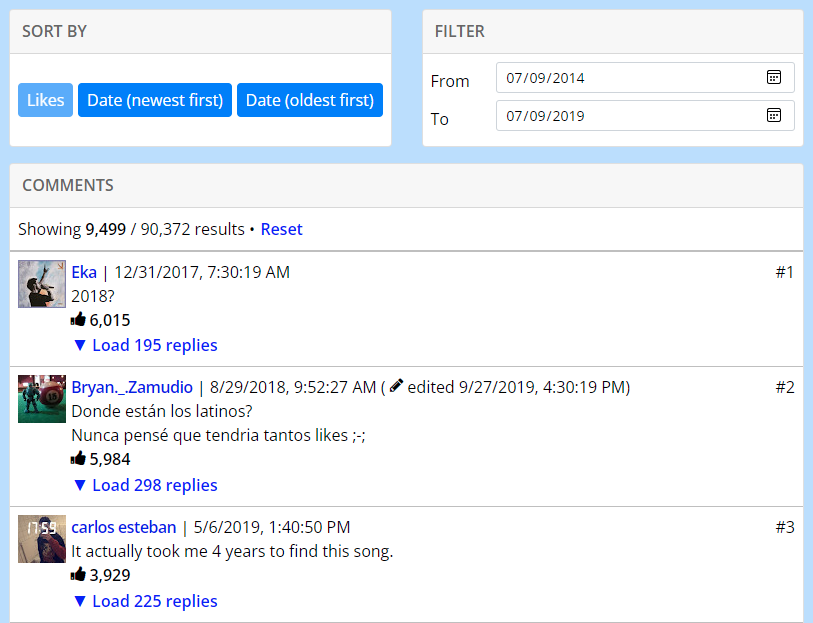
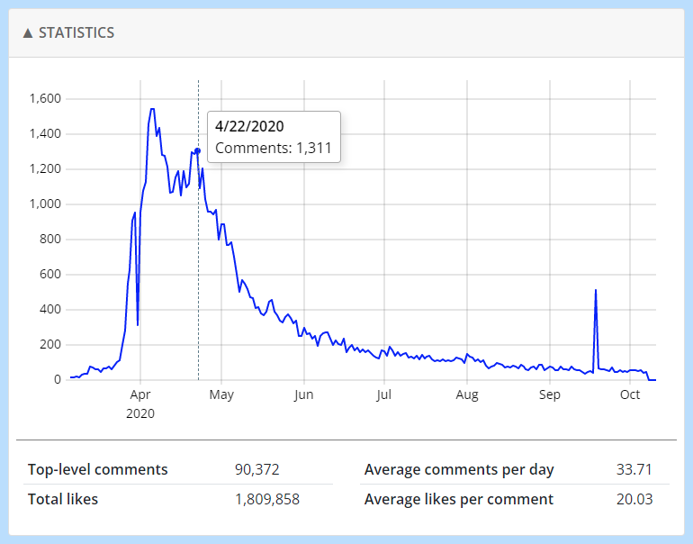

## YouTube Comment Viewer 💬
A web app for sorting and filtering comments on YouTube videos. Enter any video link and the comments will start loading in the background.

This project is mostly just me getting familiar with Node.js and SQLite.

### Website
#### https://commentviewer.com

### Screenshots

### Features
- Load large numbers of comments (> 1 million)
- Sort comments by date (oldest to newest) or by likes
- Filter comments by date
- View exact publish timestamps for comments and videos
- See comment trends on an interactive graph
- Input direct links to a comment
- Works decently on mobile

### Changelog
For new changes, check out the [changelog](CHANGELOG.md).
